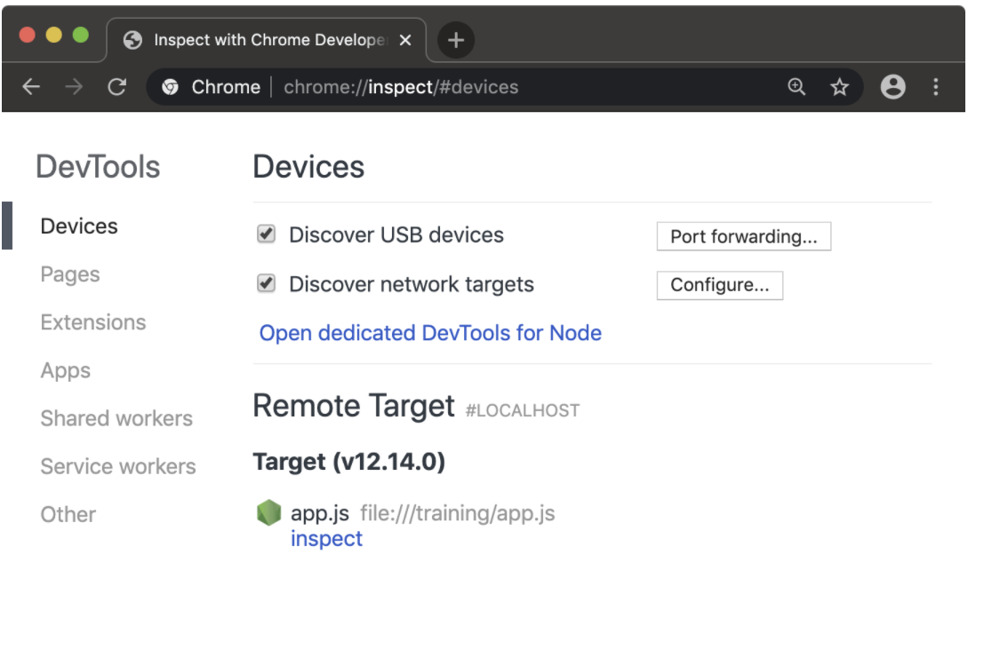

# DEBUGGING AND DIAGNOSTICS

Per poter debuggare un'applicazione, il processo di NodeJS deve essere avviato in modalità _inspect_. Grazie a questa modalità il processo può essere attaccato anche ai devtools di chrome, per rendere più appagante l'esperienza di debug.

Supponiamo di avere un programma chiamato app.js contenente il seguente codice

```js
function f (n = 99) {
  if (n === 0) throw Error()
  f(n - 1)
}
f()
```

per lanciare l'applicazione app.js in modalità debug si utilizza il seguente comando 

```bash
$> node --inspect app.js
```

per lanciare, invece, l'applicazione con un punto di debug attivo, il comando è 

```bash 
$> node --inspect-brk app.js
```

Il risultato dei due precedenti comandi è

```bash
Debugger listening on ws://127.0.0.1:9229/c1465015-b2af-4275-aea0-a5923bd65739
For help, see: https://nodejs.org/en/docs/inspector
```

e come si vede da `ws`, il protocollo di debug utilizza le WebSocket. Per debuggare il processo, adesso, basta semplicemente aprire i devtools di chrome (o di altro browser)

