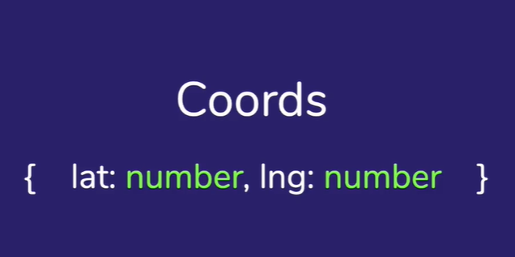

# Composizione
In JS possiamo dire di non avere il problema della tipizzazione

```js
let myVar = 1; // Number
myVar = 'Hello'; // String
myVar = true; // Boolean
```

ma in realtà i tipi di dato ci sono in JS: **Boolean**, **Number**, **String**, **undefined**, **null**, **BigInt**, **Symbol**, **Function** e **Object**. Potremmo comunque definire un nostro tipo di dato, come ad esempio questo dell'immagine



ma è una cosa che rimane solo nella nostra mente e non possiamo codificarlo all'interno di JavaScript, ovvero non possiamo aggiungerlo ai tipi esistenti, per farlo dovremmo usare uno strumento come Typescript, dove si può fare una cosa del genere `type Coords = { lat: number, lng: number };`.

La programmazione funzionale ci aiuta a far sì che il nostro programma si rompa il meno possibile e che possiamo comporre le nostre funzioni per comporne delle altre.

>Se usiamo typescript ci troviamo in un ambiente ideale per scrivere codice funzionale

La sintassi di Hindley-Milner è una sintassi che nasce in ambito matematico
```js
// strLength :: String -> Number
const strLength = s => s.length;
```
Possiamo utilizzare le regole di questa sintassi per descrivere le nostre funzioni. Vediamo alcuni esempi
```js
// join :: [String] -> String -> String
const join = a => sep => a.join(sep);

// isEmpty :: a -> Boolean
const isEmpty = x => !!x;

// id :: a -> a
const id = x => x;
```

Con questa sintassi possiamo pure utilizzare i tipi di dato custom 
```js
// getDistance  :: Coords  -> Coords -> Number
const getDistance = p1 => p2 => ...;
```

Potremmo anche specificare dei constraint, ovvero dei vincoli ai nostri tipi di dato. 
```js
// introduce :: Person a => a -> String
```

Una funziona è detta Pointfree quando non menziona i dati su cui opera
```js
[1, 2, 3, 4, 5]
    .filter(n => n % 2 === 0)
    .map(n => n * 2)
    
// Filtro l'array per ottenere solo i numeri pari e poi rimappo per ottenere 
// il valore doppio. Creiamo delle funzioni che ci aiutino

const double = n => n * 2;
const isEvent = n => n % 2 === 0;
[1, 2, 3, 4, 5]
    .filter(n => isEven(n))
    .map(n => double(n));
    
// Quello che viene scritto sopra è perfettamente ok, ma un programmatore funzionale
// lo riscriverebbe in questo modo
[1, 2, 3, 4, 5]
    .filter(isEven)
    .map(double);
    
// Lo stile di scrittura sopra è quello che viene chiamato POINTFREE.
// In questo modo si evita di creare una funziona il cui solo scopo
// sarebbe solamente quello di passare dei dati ad un'altra funzione e 
// ritornarne il risultato

// Facciamo un passo in più ed estrapoliamo tutto in una funzione

const evenDouble = array => array.filter(isEven).map(double);

// La funzione accetta un array, applica i metodi filter e map e ritorna il risultato
// ma la nostra funzione adesso menziona l'array su cui sta lavorando
// quindi la nostra nuova funzione non è pointfree

// Come posso farla a riscriverla senza menzionare l'array?
```

Prima di parlare di come riscrivere la nostra ultima funzione in modo pointfree, ovvero senza menzionare l'array, doppiamo parlare di closure, applicazione parziale e currying.

Una closure è l'insieme tra la funzione e l'ambiente dove è stata creata.
```js
var n = 2;

function multiply(m) {
    return n * m;
}

// Ovviamente funziona in quanto le funzioni hanno accesso alle variabili
// presenti nell'ambiente in cui vengono create.

// In effetti possiamo dire che per ogni funzione che dichiariamo JS crea una
// closure per legare la funzione all'ambiente in cui viene scritta, chiamato 
// formalmente LEXICAL SCOPE

// Inseriamo una funzione in un'altra funzione

function multiply(n) {
    return function(m) {
        return n * m;
    }
}

// Il programmatore funzionale però la riscrive con le arrow
const multiply = n => m => n * m;

console.log(multiply(3)(2));
```
Quella appena creata nell'esempio sopra è quella che viene definita come **closure**.

Un'applicazione parziale è qualcosa come questa: `const multiplyByTwo = muultiply(2);`, ovvero eseguo parzialmente la mia closure.

In programmazione funzionale pura tutte le funzioni sono unarie, ovvero accettano un solo parametro. Questo comportamento ci sarà molto utile quando parleremo di composizione. Il currying è la pratica di trasformare una funzione di N parametri in N funzioni da un parametro ciascuna.

Ok, adesso creiamo la composizione
```js
// Come prima cosa costruiamo due funzioni che accettino un predicato e l'array

function map(fn, array) {
    return array.map(fn); // Stile pointfree
}

function filter(fn, array) {
    return array.filter(fn);
}

// Utilizzo la tecnica del currying per rendere le funzioni unarie

function map(fn) {
    return function(array) {
        return array.map(fn);
    }
}

function filter(fn) {
    return function(array) {
        return array.filter(fn);
    }
}

// Scriviamole come arrow function
const map = fn => array => array.map(fn);
const filter = fn => array => array.filter(fn);

// Vediamo adesso la funzione di composizione
const double = n => n * 2;
const isEvent = n => n % 2 === 0;

const filterEven = filter(isEven);
const mapDouble = map(double);

const evenDouble = x => mapDouble(filter§ven(x));

console.log(evenDouble([1,2,3,4,5])) // [4, 8]

// Ancora però la nostra funzione non è pointfree e stiamo facendo la combinazione
// manualmente e questo è ancora un approccio imperativo, mentre noi ne 
// vogliamo uno dichiarativo

const compose = (f, g) => x => f(g(x));
const evenDouble = compose(mapDouble, filterEvent); // ORdine inverso, 
// quindi prima filtra poi mappa

// Posso anche riscriverla così, senza variabili
const evenDouble = compose(
    map(double),
    filter(isEven)
);

// Due criticità
// 1. Cosa succede se i tipi non coincidono?
// 2. Cosa succede se g va in errore o ritorna null/undefined?
```

Facciamo un esercizio: scriviamo una nostra funzione compose che accetta un numero variabile di funzioni

#### **`pointfree.js`**
``` js
const compose = (f, g) => x => f(g(x));
// Adesso modifichiamola per fare in modo che accetti un numero arbitrario di argomenti

// Per prima cosa la utilizzo con varargs
export const compose = (...fns) => x => fns.reduceRight(
    (v, f) => f(v), x
);

// reduceRight fa lo stesso lavoro del reduce normale ma in ordine inverso, che è quello che serve a noi per applicare le funzioni

// Esiste solitamente anche un'altra variante di compose che fa la riduzione da sinistra a destra che di solito viene chiamata pipe

export const pipe = (...fns) => x => fns.reduce(
    (v, f) => f(v), x
);
```

#### **`index.js`**
```js
import { compose, pipe } from './pointfree';

const map = fn => array => array.map(fn);
const filter = fn => array => array.filter(fn);

const isEven  = n => n%2 === 0;
const double = n => n*2;

const evenDouble = compose(
    map(double),
    filter(isEven)
);

console.log(evenDouble([1, 2, 3, 4, 5])); // [4, 8]

// Col pipe invece il comportamento sarà al contrario, ovvero prima verranno raddoppiati tutti i numeri e poi verranno filtrati per prendere solo quelli pari.
// Ovvero si eseguono le funzioni nell'ordine in cui sono dichiarate

const evenDouble = pipe(
    map(double),
    filter(isEven)
);

console.log(evenDouble([1, 2, 3, 4, 5])); // [2, 4, 6, 8, 10]
```

___
**Nota**

La composizione di funzioni in matematica, come in programmazione, gode della proprietà associativa. Quando si dice che anche le funzioni godono di questa proprietà di solito commettiamo un errore, vediamo un esempio
```js
const one = x => f(g(h(x)));
const two = x => f(h(g(x)));
const three = x => g(f(h(x)));

// Le tre funzioni sopra oltre a non essere la stessa cosa, non danno nemmeno lo stesso risultato
```

Il fatto che la composizione di funzioni sia associativa è dimostrabile, vediamo un esempio

```js
import { compose } from './pointfree';

const increment = x => x + 1;
const decrement = x => x - 1;
const double = x => x * 2;

const f = compose(
    increment, double, decrement
);
console.log(f(5)); // Risultato 9
// Perchè il risultato è 9? Perché 5 viene prima decrementato a 4, raddoppiato a 8 e infine incrementato di 1.

// Ora uniamo double e decrement
const f = compose(
    increment, 
    compose(double, decrement)
);
console.log(f(5)); // Risultato 9

const g = compose(
    compose(increment, double) 
    decrement
);
console.log(g(5)); // Risultato 9

// Quindi abbiamo visto che non è importante come compongo (ovvero come metto le parentesi), l'importante è che l'ordine sia sempre lo stesso, infatti possiamo vedere sopra che abbiamo sempre increment, double, decrement
```

Perché è così importante che la composizione di funzioni sia associativa? Perché questa proprietà matematica ci da la certezza che qualsiasi sia il livello di granularità delle nostre funzioni possiamo sempre comporle per creare funzioni più complesse per ottenere lo stesso risultato. Non è importante l'ordine di valutazione delle espressioni, ciò che è importante è l'ordine di apparizione
___

Esiste una variante di reduce, in programmazione funzionale, che viene chiamata **fold** il cui funzionamento è identico
```js
const reduce = f => xs => xs.reduce(f);
const reduceRight = f => xs.reduceRight(f);

const reduceSum = reduce((a, b) => a + b);
console.log(reduceSum([1, 2, 3])); // Risultato 6

// Reduce se viene usato senza valore iniziale quando processa i dati di input salta il primo valore e lo utilizza come accumulatore

const fold = f => x => xs => xs.reduce(f);
const foldRight = f => x => xs.reduceRight(f);

const foldSum = fold((a, b) => a + b)(0);
console.log(foldSum([1, 2, 3])); // Risultato 6
```